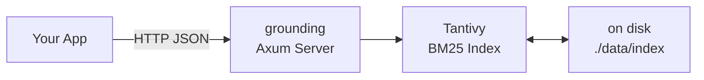

# Grounding

**Single-binary retrieval engine for LLM context. No external database required.**

```bash
cargo build --release
./target/release/grounding serve --data-dir ./data --port 8080

# Index a document
curl -X POST http://localhost:8080/index \
  -H "Content-Type: application/json" \
  -d '{"doc_id":"1","title":"Hello","body":"World wide web hello","source_url":"https://example.com"}'

# Search
curl -X POST http://localhost:8080/query \
  -H "Content-Type: application/json" \
  -d '{"query":"hello world","top_k":3}'
```

## Architecture



## API

| Endpoint | Method | What it does |
|---|---|---|
| `/health` | GET | Health check |
| `/metrics` | GET | Indexed/query counters |
| `/index` | POST | Index a document |
| `/index/batch` | POST | Index multiple documents |
| `/documents` | POST | Retrieve by doc_id |
| `/query` | POST | BM25 search |

Request/response bodies use `Content-Type: application/json`. Full reference at [API.md](./docs/API.md).

## Performance

100,000 documents (286 MB text) indexed in ~51 seconds. Queries return in ~7ms. Index uses ~300 MB on disk.

## Design

- **Single binary** — Tantivy is embedded. No separate server process. `FROM scratch` Docker ~10 MB.
- **BM25 today, vectors in V2** — Field boosting is sufficient for code/docs. Vectors add without API breakage.
- **Distribution path** — Embedded index → add vectors → swap to Quickwit for clustered scale.

See [DECISIONS.md](./docs/DECISIONS.md) for full rationale.
