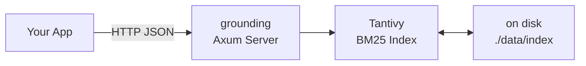

# Grounding

[](https://github.com/gothammm/grounding/actions/workflows/release.yml)

**Single-binary retrieval engine for LLM context. No external database required.**

```bash
cargo build --release
./target/release/grounding serve --data-dir ~/.config/grounding/data --port 8080

# Index a document
curl -X POST http://localhost:8080/index \
  -H "Content-Type: application/json" \
  -d '{"doc_id":"1","title":"Hello","body":"World wide web hello","source_url":"https://example.com"}'

# Search
curl -X POST http://localhost:8080/query \
  -H "Content-Type: application/json" \
  -d '{"query":"hello world","top_k":3}'
```

## Architecture



## API

| Endpoint | Method | What it does |
|---|---|---|
| `/health` | GET | Health check |
| `/metrics` | GET | Indexed/query counters |
| `/index` | POST | Index a document |
| `/index/batch` | POST | Index multiple documents |
| `/documents` | POST | Retrieve by doc_id |
| `/query` | POST | BM25 search |
| `/mcp` | GET/POST | MCP Streamable HTTP endpoint |

Request/response bodies use `Content-Type: application/json`. Full reference at [API.md](./docs/API.md).

## Installation

Pre-built binaries for **Linux** (x86_64) and **macOS** (Intel & Apple Silicon) are available on the [Releases page](https://github.com/gothammm/grounding/releases).

### Shell Install Script (Quick)
```bash
curl -sSfL https://raw.githubusercontent.com/gothammm/grounding/main/install.sh | sh
```

Install a specific version:
```bash
curl -sSfL https://raw.githubusercontent.com/gothammm/grounding/main/install.sh | sh -s -- --version v0.1.0
```

Install to a custom directory:
```bash
curl -sSfL https://raw.githubusercontent.com/gothammm/grounding/main/install.sh | sh -s -- --dir /usr/local/bin
```

### Manual Download
Download and extract the tarball for your platform from the [Releases page](https://github.com/gothammm/grounding/releases), then place the binary in your PATH:

```bash
# Linux
curl -L https://github.com/gothammm/grounding/releases/download/v0.1.0/grounding-x86_64-unknown-linux-gnu.tar.gz | tar xz
sudo mv grounding /usr/local/bin/

# macOS (Intel)
curl -L https://github.com/gothammm/grounding/releases/download/v0.1.0/grounding-x86_64-apple-darwin.tar.gz | tar xz
sudo mv grounding /usr/local/bin/

# macOS (Apple Silicon)
curl -L https://github.com/gothammm/grounding/releases/download/v0.1.0/grounding-aarch64-apple-darwin.tar.gz | tar xz
sudo mv grounding /usr/local/bin/
```

### Cargo Install (Development)
```bash
cargo install grounding
```

## MCP

Grounding exposes a **Model Context Protocol** interface for LLM agents. Configure it in your agent's MCP settings:

### OpenCode

Add to your `opencode.json`:

```json
{
  "$schema": "https://opencode.ai/config.json",
  "mcp": {
    "grounding": {
      "type": "local",
      "command": ["grounding", "mcp", "--data-dir", "~/.config/grounding/data"],
      "enabled": true
    }
  }
}
```

### Claude Code

Add to your `claude_desktop_config.json`:

```json
{
  "mcpServers": {
    "grounding": {
      "command": "grounding",
      "args": ["mcp", "--data-dir", "~/.config/grounding/data"]
    }
  }
}
```

### Transports

Two transports are available:

```bash
# Stdio (for local agents like Claude Code)
grounding mcp --data-dir ~/.config/grounding/data

# Streamable HTTP at /mcp (for remote agents)
grounding serve --data-dir ~/.config/grounding/data --port 8080
```

MCP tools: `search_docs`, `index_document`, `get_document`, `batch_index`. Full reference at [MCP.md](./docs/MCP.md).

## Build from Source

```bash
cargo build --release
./target/release/grounding serve --data-dir ~/.config/grounding/data
```

## Design

- **Single binary** — Tantivy is embedded. No separate server process. No external database required.
- **BM25 today, vectors in V2** — Field boosting is sufficient for code/docs. Vectors add without API breakage.
- **Distribution path** — Embedded index → add vectors → swap to Quickwit for clustered scale.

See [DECISIONS.md](./docs/DECISIONS.md) for full rationale.
